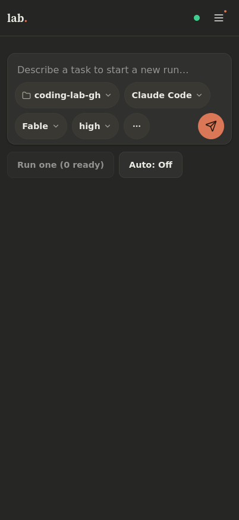
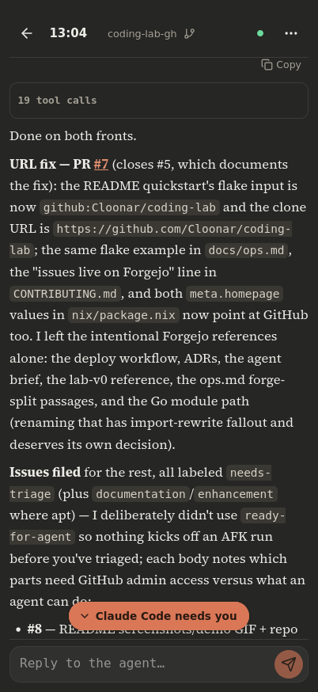
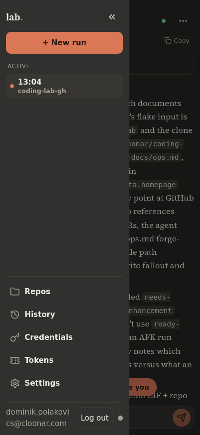

# lab

**lab** is a self-hosted server with a phone-first web interface for running coding agents against your git repositories — interactively or unattended.

You add repositories and credentials in the UI, then start **manual instances** (interactive agent sessions you drive from lab's built-in chat, from any device) or **AFK runs** (unattended sessions that pick up one `ready-for-agent` issue, resolve it, and open a pull request). Repositories without a usable forge tracker get a built-in issue tracker with lab-internal change requests — reviewable and mergeable from your phone.

<p align="center">
  
  
  
</p>

## Features

- **Manual instances** — interactive agent sessions, each in its own git worktree on its own branch. Drive them through lab's embedded chat (messages, tool activity, answerable dialogs, interrupt), or hop into the provider's own web surface via a captured deep link (claude.ai for Claude Code).
- **AFK runs** — unattended sessions that claim one `ready-for-agent` issue from the repo's tracker, resolve it, and open a PR. Budget clock, three-strikes pause, guarded teardown, restart-safe re-adoption.
- **Multiple agent providers** — Claude Code and Codex ship today, behind an `AgentProvider` seam designed so a new provider is one adapter, zero refactor (see [`docs/agents/provider-authoring.md`](docs/agents/provider-authoring.md)).
- **Tracker integration** — Forgejo and GitHub forges, or lab's built-in tracker (issues, labels, comments, change requests with diff view and merge from the UI). Agents talk to whichever tracker the repo binds through one CLI: `labctl`.
- **Container or host runner** — per repo, sessions run either in a rootless podman container (your dev image + lab's injected agent tools) or directly on the host.
- **Credentials vault** — SSH keys, HTTPS tokens, and forge API tokens encrypted at rest (AES-256-GCM, operator-owned master key file); secrets are never displayed back and never land in URLs or repo config.
- **Incogni mode** — per-repo leak-proofing for agent-authored content: neutral branch names, attribution off, server-side body sanitization, and a pre-push guard.
- **Operable by default** — single static Go binary with the SPA embedded, SQLite (default) or PostgreSQL, live updates over SSE, PWA with Web Push, `/healthz` `/readyz` `/metrics`.
- **Nix-first packaging** — a flake with `packages.{lab,labctl}`, a full NixOS module, and a devshell; but the binary runs on any Linux.

## How it works

```
┌─ SolidJS SPA (embedded static) ── PWA, SSE client
│
├─ HTTP server (net/http)
│   ├─ /api/v1/*      operator API (session cookie / PAT)
│   ├─ /agent/v1/*    agent API (scoped run tokens; labctl talks here)
│   ├─ /api/v1/events SSE stream
│   └─ /healthz /readyz /metrics
│
├─ Core services
│   ├─ RepoService        add(clone)/settings/remove; bare reference clones
│   ├─ CredentialVault    AES-256-GCM at rest; materialize-for-op; master key file
│   ├─ InstanceService    start/stop manual instances; deep-link capture
│   ├─ AFKEngine          scheduler + reaper + claims
│   ├─ GitEngine          fetch/worktree/branch/teardown/sweep
│   ├─ TrackerRegistry    Tracker interface → forgejo | github | builtin
│   ├─ ProviderRegistry   AgentProvider interface → claude-code | codex
│   ├─ SessionRunner      tmux wrapper + prlimit cap / rootless podman
│   ├─ Seeder             trust, settings, skills bundle, CLAUDE.local.md, incogni
│   └─ Store              SQLite/Postgres repositories + goose migrations
│
└─ External: tmux · git · ssh · agent CLIs · forge REST APIs
```

Source-of-truth layering (load-bearing): **tmux** answers "is the session alive"; **git refs** answer "what is claimed / what work exists"; **the tracker** answers "is there a PR / is the issue open"; **the DB** stores configuration, credentials, the built-in tracker, and run *history*. Reconciliation (startup + throttled sweep) re-derives live state; the DB is never the only witness to something the world can contradict. A service restart or deploy never kills a running session — lab re-adopts surviving sessions on startup.

The unattended loop end to end: you label an issue `ready-for-agent` → the AFK scheduler claims it by creating a branch → the session gets a seeded prompt, the repo worktree, and `labctl` with a run token scoped to that one repo → the agent resolves the issue and opens a PR (or a lab-internal change request) referencing `Closes #N` → the reaper sees the PR as the done-signal and tears the run down under the guarded rule (dirty or unmerged work is parked, never destroyed) → you review and merge from your phone.

## Getting started

**[`docs/getting-started.md`](docs/getting-started.md)** walks the whole first session: install → login → credentials → first repo → first interactive instance → first unattended run. The short version:

### Requirements

Any Linux host. On PATH: `git`, `tmux`, `ssh` (openssh), `prlimit` (util-linux). Provider CLIs (`claude`, `codex`) are only needed for host-runner repos — with the container runner (the default on the NixOS module) they come from lab's published agent-tools images instead.

### NixOS (recommended)

```nix
{
  inputs.coding-lab.url = "github:Cloonar/coding-lab";

  # in the host config:
  imports = [ coding-lab.nixosModules.lab ];
  services.lab = {
    enable = true;
    baseUrl = "https://lab.example.com";   # set when behind TLS
  };
}
```

The module makes the host container-ready out of the box and asserts the load-bearing unit invariants (sessions survive service restarts). All options, secrets wiring (sops / `LoadCredential`), and reverse-proxy setup: [`docs/ops.md`](docs/ops.md).

### Download a release binary

Every [release](https://github.com/Cloonar/coding-lab/releases) publishes static linux binaries (amd64, arm64) plus a `checksums.txt`:

```sh
curl -LO https://github.com/Cloonar/coding-lab/releases/latest/download/lab-linux-amd64
curl -LO https://github.com/Cloonar/coding-lab/releases/latest/download/checksums.txt
grep lab-linux-amd64 checksums.txt | sha256sum -c -
chmod +x lab-linux-amd64
mkdir -p ~/.local/bin
mv lab-linux-amd64 ~/.local/bin/lab   # or /usr/local/bin for a system install
~/.local/bin/lab                      # listens on :8080, state in ~/.local/state/lab, sqlite
```

Swap `amd64` for `arm64` on an aarch64 host. `labctl` — the agent-side CLI — ships the same way, as `labctl-linux-amd64` / `labctl-linux-arm64`; grab it too when this host runs sessions itself, but a host that only runs the server doesn't need it. See [Requirements](#requirements) above for what else needs to be on PATH.

Migrations apply on startup and the vault master key is auto-generated on first start; open the web UI and the first-run wizard creates the operator account. A systemd unit template and the full flag/env configuration reference are in [`docs/ops.md`](docs/ops.md).

### Build from source

```sh
git clone https://github.com/Cloonar/coding-lab && cd coding-lab
make lab labctl          # static binaries → bin/lab, bin/labctl  (needs Go 1.26 + Node)
./bin/lab                # listens on :8080, state in ~/.local/state/lab, sqlite
```

Same startup behavior as above (migrations, auto-generated master key, first-run wizard).

### Developing

```sh
nix develop        # go, gopls, golangci-lint, node, git, tmux, util-linux, sqlite
make lab           # build SPA + server binary with embedded UI → bin/lab
make labctl        # agent-side CLI → bin/labctl
make test          # go test ./... (real git/tmux/prlimit integration tests)
make lint          # golangci-lint run
```

Web dev loop (no embedding, live reload):

```sh
go run ./cmd/lab        # API on :8080
cd web && npm run dev   # Vite dev server; proxies /api and /healthz → :8080
```

`nix flake check` is the CI truth: package builds (which carry the Go test suite against real git/tmux/prlimit and the SPA vitest suite), golangci-lint, and an eval-proven NixOS module with its unit invariants asserted. See [`CONTRIBUTING.md`](CONTRIBUTING.md).

## Surfaces at a glance

**Operator API** (`/api/v1`, session cookie or `lab_pat_…` bearer token, CSRF-guarded for ambient auth): first-run setup + login, PAT CRUD, credentials CRUD (no secret readback; delete 409s while referenced), repos (add → async bare clone with SSE progress, settings PATCH, guarded delete, clone retry), instances (start/stop/stop-all), Parked list + Discard, AFK (start / auto toggle / three-strikes reset), built-in issues + comments + labels + ready queue, change requests (list, detail with live diff, merge, close), run history, provider catalog + provider auth (status / login start / login code), runtime settings, and `GET /api/v1/events` (SSE: `repo.changed`, `run.changed`, `parked.changed`, `clone.progress`, `claude.auth.changed`, `issue.changed`, `cr.changed`, `heartbeat`).

**Agent API** (`/agent/v1`, run-token auth, scoped to the run's repo): issue view (the run's claimed issue) / list / create / comment / close, label add/remove/list, idempotent label create, PR create — routes everything to the repo's tracker binding (forge or built-in), injects/validates `Closes #N` on PR create, and applies incogni sanitization server-side to every agent-authored body.

**`labctl`** (on every session's PATH; reads `LAB_URL`/`LAB_TOKEN` from the session env):

```
labctl issue view [n]                 show the run's claimed issue (or issue n), with comments
labctl issue list                     list open issues (number, state, created, labels, title)
labctl issue create --title T --body B [--labels a,b]
                                      file a new issue, labels attached at creation
labctl issue comment <n> <body>       comment on issue n
labctl issue label add <n> <a,b>      add labels (comma-separated) to issue n
labctl issue label remove <n> <a,b>   remove labels from issue n
labctl issue close <n>                close issue n (comment the reason first)
labctl label list                     list the repo's labels (name, color, description)
labctl label create --name N [--color C --description D]
                                      create the label if missing (idempotent)
labctl pr create --title T --body B   open a PR/CR for the current branch
```

**Probes**: `/healthz` (liveness, always 200), `/readyz` (503 while the DB is unreachable), `/metrics` (Prometheus). All three are mounted outside auth.

## Layout

```
cmd/lab, cmd/labctl    binaries (module git.cloonar.com/Cloonar/coding-lab)
internal/              config, store, vault, gitx, tmuxx, startguard, provider,
                       tracker, afk, instance, reconcile, seeder, events,
                       httpapi, agentapi, metrics, webui, labctl, compat, …
web/                   SolidJS SPA (Vite, TypeScript, vitest)
migrations/            goose migrations, sqlite + postgres (parity-tested)
assets/skills/         vendored skills bundle, embedded and seeded per worktree
containers/            agent-tools OCI images (provider CLI + labctl injection)
nix/, flake.nix        packages, NixOS module, devshell, checks
docs/                  getting started, ops, ADRs, agent docs, v0 reference
```

## Documentation

- [`docs/getting-started.md`](docs/getting-started.md) — first-session walkthrough: install, first repo, first instance, first AFK run.
- [`docs/ops.md`](docs/ops.md) — deployment (NixOS + bare metal), configuration reference, state-dir layout, backup/restore, container runner, CI runner prerequisites, observability.
- [`docs/model-selection.md`](docs/model-selection.md) — recommended model/effort settings per stage of the agent workflow.
- [`CONTEXT.md`](CONTEXT.md) — the domain glossary; identifiers and UI copy use these terms verbatim.
- [`docs/adr/`](docs/adr/) — every significant design decision as an ADR, from repo/language choice through the container runner and read-only imports.
- [`docs/agents/`](docs/agents/) — docs consumed by coding agents working *on* this repo (issue-tracker conventions, triage labels, provider authoring).
- [`docs/definition-of-done.md`](docs/definition-of-done.md) — the production checklist with per-item verification: what is automated, what needs a real host.
- [`docs/agent-brief.md`](docs/agent-brief.md) — the original product contract this codebase was built from (historical, see below).
- [`docs/reference/lab-v0/`](docs/reference/lab-v0/README.md) — the v0 prototype, **read-only**: the behavioral spec for the session/worktree/AFK core.

## History

lab is itself a product of the workflow it hosts: this codebase is the production rewrite of a working prototype (vendored read-only at `docs/reference/lab-v0/`), implemented end to end by a coding agent from a settled product brief ([`docs/agent-brief.md`](docs/agent-brief.md)), milestone by milestone, with the decisions recorded as ADRs along the way. The brief and the v0 reference are kept as historical documents — [`docs/ops.md`](docs/ops.md) and the ADRs describe the system as it is today.

## Contributing

Issues and pull requests live on [github.com/Cloonar/coding-lab](https://github.com/Cloonar/coding-lab). See [`CONTRIBUTING.md`](CONTRIBUTING.md) for the dev environment, test suites, CI gates, and the project's conventions (Conventional Commits, the `CONTEXT.md` vocabulary, ADRs).

## License

[GNU Affero General Public License v3.0](LICENSE) (AGPL-3.0). You are free to use, modify, and redistribute lab — including commercially — but if you distribute it or offer a modified version over a network, you must make your source changes available under the same license. The vendored agent-skills bundle under [`assets/skills/`](assets/skills/README.md) includes material from [mattpocock/skills](https://github.com/mattpocock/skills), MIT-licensed (GPL-compatible) — its notice is kept at [`assets/skills/LICENSE.upstream`](assets/skills/LICENSE.upstream).
